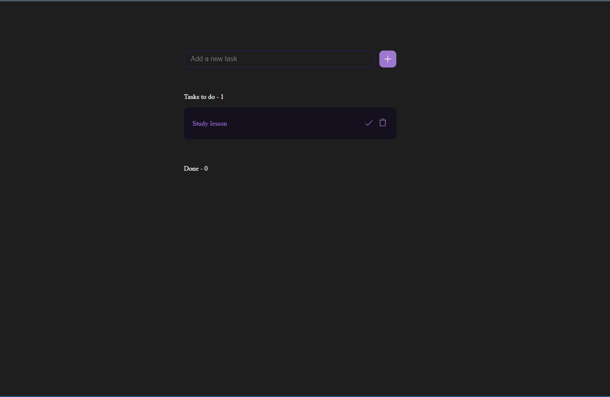

# React Todo App 🎯

A modern, interactive **Todo application** built with React and Vite.  
Users can add tasks, mark them as complete, and delete them.  
🎉 A confetti animation celebrates when all tasks are completed!

---

## 🎨 Design
This Todo App UI is inspired by a public Figma design:  
[Figma Community Design](https://www.figma.com/design/T5bBgEPhcDhY5lQ4qui1nx/Todo-App--Community-?node-id=1-171&t=vNoSSRK8iGn6i7IC-1)

> Tip: Click the link to view the prototype

---

## 🚀 Demo


---

## 🛠 Technologies
- **React** (Vite)  
- **CSS** (`App.css`)  
- **Confetti animation** via `react-confetti`  

---

## ✅ Features
- Clean UI inspired by **Figma Community Design**  
- Add tasks via input field and **Enter key** or **Add button**.  
- Mark tasks as **completed** ✅.  
- Delete tasks ❌.  
- Confetti animation triggers when **all tasks are completed**.  
- Real-time task counter showing remaining tasks.  

---

## 💻 Installation

```bash
1. Clone the repository:
    git clone https://github.com/begumkucuk35/react-todo-app.git
2. Navigate to project folder:
    cd react-todo-app
    cd web
3. Install dependencies:
    npm install
4. Start development server:
    npm run dev
5. Open in browser:
    http://localhost:5173

